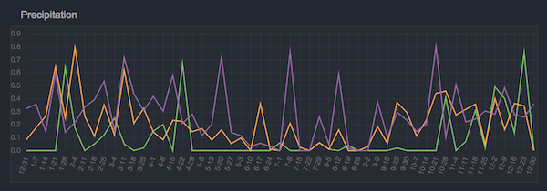
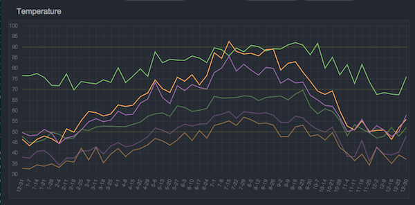

# Climate Scraper
I wanted to compare climate data across several regions, over a span of years.  This tool scrapes data, reorganizes it, and presents it in a way that is appropriate for historical comparison.

Here is an [example report](./Report_2016-03-08.html).

## Scrape???
This is not the dark ages of the internet!  We have APIs now.  In fact, there are multiple freely available APIs for climate data.  Also, they all suck.

I was saddened until I found a site that had the information I needed, and no restrictive TOS.  Like a 90's web developer, I rolled up my sleeves and started scraping!

I was actually a little dissapointed at how easy it has become.  The quality of Python libraries made the task trivial.  I barely even wrote regex.

## What's good
A good data transformation system has at least 3 layers: collect, parse, present.  This allows you to iterate on each stage, without repeating previous stages.

The intermediary data is easy to work with.  You could build many presentation layers without reworking any previous stages.

Raw data and intermediary data are cached, making regeneration fast.

## What's bad
Scraping is always fragile, although the data caching does provide a layer of insulation.

